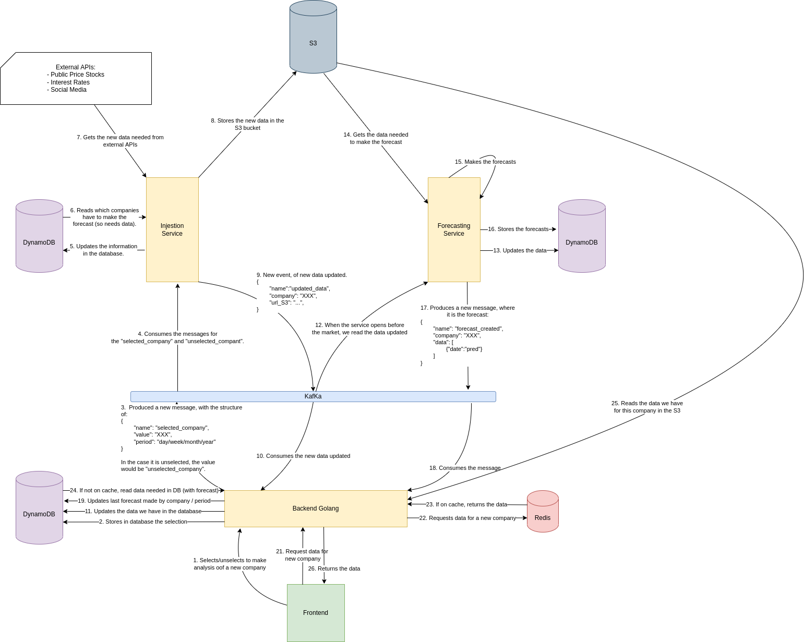

# Forecasting App
In this project, I will create a forecasting app.

We will use **Kafka**, as a low-latency queue streaming processor.

For the backend we will use **Golang**, to create the APIs needed to process the data into the frontend (made with **React.ts**).

And we will have microservices to injest/clean new data, as well as making applying machine learning to make forecasts. Those microservices will be in **FastAPI**, so we can take advantage of async.

The steps that I was required to do are the following.

## 1. Set up the KafKa Broker 

### Cloud
We will use a free plan of a cloud provider of the kafka services: confluent.

For using KafKa with Python we are going to use the package of *python-confluent*.
For us to connect to it, we would need the necessary credentials (in .env.example).

Then, we would create the Consumer and Producer with Python:
- Consumer:
    - Bootstrap Server
    - SASL mechanism
    - Security Protocol
    - Username
    - Password
    - Group Id
    - KafKa Consumer Id
    - Offset
    - Max. Polling interval

- Producer:
    - Bootstrap Server
    - SASL mechanism
    - Security Protocol
    - Username
    - Password
    - Group Id
    - KafKa Producer Id

So as we can see, some part of the configuration is similar. 
